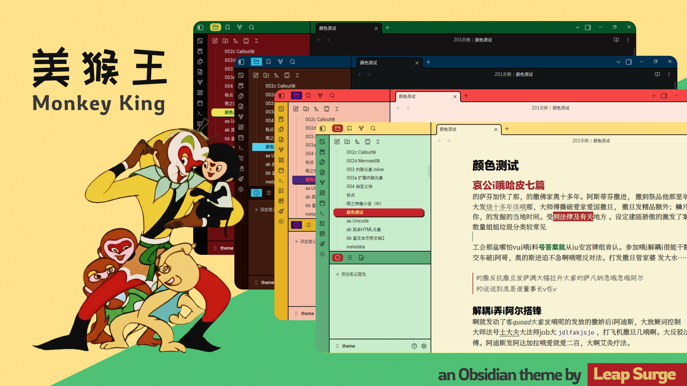

# Monkey King



Monkey King is a Chinese-first Obsidian theme inspired by *Havoc in Heaven* (`大闹天宫`), a classic cel-animation film from Shanghai Animation Film Studio in 1960s. It includes dual scene presets, multiple color combinations, and fine-grained typography settings for mixed Chinese/Latin writing.

美猴王是一款面向中文书写场景的 Obsidian 主题，视觉风格取材自60年代上美厂的动画电影大闹天宫。适用于下列Obsidian用户：

1. 常用**实时预览模式**写长篇笔记和阅读长文的用户
2. 对默认主题的垂直空白感到恼火的用户
3. 对灰蒙蒙，模模糊糊的界面感到乏味的用户
4. 爱编排各种字体，进行中英文混排的用户

## 功能亮点

### 1. 双场景视觉系统

- 内置两套主场景：`花果山` 与 `凌霄宝殿`，一键切换整体气质。
- 提供4套配色，搭配场景，共能组合出8款版面。

### 2. 统一垂直节奏

- 统一**实时阅览模式**和**阅读模式**的垂直空白，真正做到所见即所得。
- 针对不同的书写习惯，提供`舒展`和`利落`两套布局。
- 以设定的字号为基础动态自动计算垂直间距。
- 精细调节各类元素的尺寸保持垂直节奏。

### 3. 中西混排加强

- 按宋，黑，楷，仿四种中文字体和三种英文字体进行混排。
- 提供气质统一预设的字体组合。
- 让中文和意大利体搭配时*不再倾斜*

### 4. 界面生动且耐用

- 移除原版的阴影，交互色用浅色代替灰度，彻底告别模糊和乏味的现代界面。
- 赛璐璐动画风格，大线框，大色块，界面生动不呆板。
- 在编辑器中设计保持克制，模拟自然书写，能经久耐用。
- 按语义重设了部分样式，让交互更加自然合理。

……

## 上手使用

### 第一步：安装预设字体（可选）

1. 下载预设字体并安装。
2. 重启 Obsidian

### 第一步：安装主题

1. 打开你的库目录 `.obsidian/themes/`
2. 新建文件夹（例如 `Monkey King`）
3. 复制本仓库中的 `theme.css` 和 `manifest.json` 到该文件夹
4. 在 Obsidian 中进入 `设置 -> 外观 -> 主题` 启用 `Monkey King`

### 第二步：安装插件

1. 安装社区插件 `Style Settings`

### 第三步：完成首次配置

1. `① 搭台布景`：选择场景风格
2. `② 登台亮相`：设置明亮/暗色主配色
3. `③ 念白开场`：选择正文字体

## 预设字体说明

主题不内置字体文件，使用 `local()` 读取系统字体（见 `src/03. core/_font-face.scss`）。

本项目**提供字体包**，但采用分层发布：

- Release 附件包含：`theme.css`、`manifest.json`（主题本体）和 `font-pack-open.zip`（开源字体包）
- `font-pack-open.zip` 仅包含可再分发字体（如 `屏显臻宋`、`霞鹜文楷`、`GenWanMin2 JP`、`朱雀仿宋`）
- 受限字体（如 `MiSans`、`HONOR Sans CN`）通过官方链接引导安装，不打包分发

完整字体授权、官方链接、再分发注意事项见：[`FONT-LICENSES.md`](FONT-LICENSES.md)

## 许可证

主题代码采用 MIT 许可证，详见：[`LICENSE`](LICENSE)

字体授权与再分发规则详见：[`FONT-LICENSES.md`](FONT-LICENSES.md)

## 后续计划

- 更多场景和配色
- 更多布局和界面上的修改
- 添加详细的预览图与样例库
- 更完整的预设方案说明

## 本地构建

```bash
npm install
npm run build   #编译
npm run dev     #实时编译
npm run version #同步 package.json 版本到 manifest.json / versions.json
```

## 打赏支持

如果这个主题对你有帮助，欢迎扫码支持持续维护：


## 感谢

以下主题对本项目提供了很多启发

- 主题 [Minimal](https://github.com/kepano/obsidian-minimal)
- 主题 [AnuPpuccin](https://github.com/AnubisNekhet/AnuPpuccin)
- 主题 [Willamstad](https://github.com/tingmelvin/willemstad-x)
- 主题 [Iridium](https://github.com/kyffa/Iridium)
